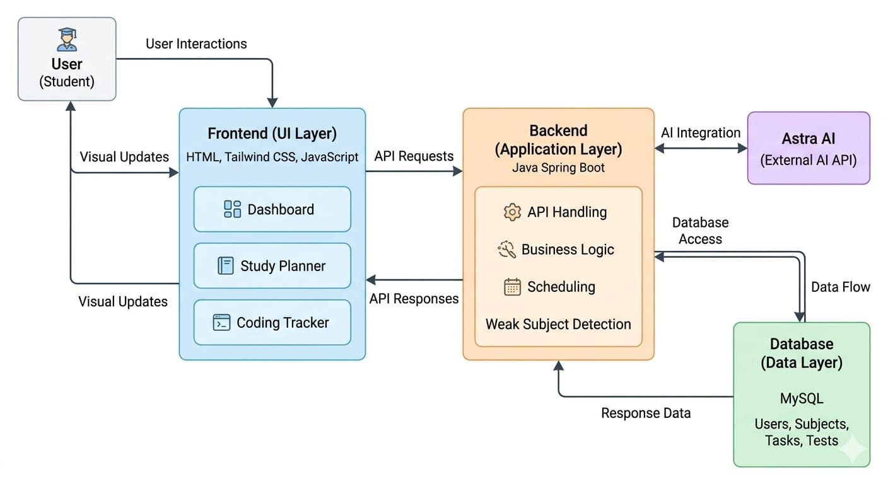

# 🏗️ System Architecture

The Smart Study Planner follows a three-tier architecture, which separates the application into three main layers:

## 🔹 1. Presentation Layer (Frontend)

This is the user interface of the application where users interact with the system.

- Built using HTML, Tailwind CSS, and JavaScript
- Provides pages such as Dashboard, Study Planner, Coding Tracker, and Analytics
- Displays data in the form of cards, charts, and schedules
- Handles user inputs and sends requests to the backend

## 🔹 2. Application Layer (Backend)

This layer handles the core logic and processing of the application.

- Built using Java and Spring Boot
- Processes user requests received from the frontend
- Implements features like:
  - Smart scheduling
  - Weak subject detection
  - Test evaluation
  - AI integration (Astra AI)
- Communicates with the database to store and retrieve data

## 🔹 3. Data Layer (Database)

This layer is responsible for storing and managing all application data.

- Uses MySQL database
- Stores information such as:
  - User details
  - Subjects
  - Tasks and schedules
  - Test results
- Ensures data consistency and retrieval efficiency

## 🔄 System Workflow

1. The user interacts with the frontend (UI)
2. The frontend sends a request to the backend via APIs
3. The backend processes the request and applies business logic
4. The backend interacts with the database to fetch/store data
5. The response is sent back to the frontend
6. The frontend updates the UI accordingly

## 🤖 AI Integration (Astra AI)

- The frontend sends user queries to the backend AI module
- The backend connects with an AI API (like OpenAI or Gemini)
- The AI processes the input and generates suggestions
- The response is displayed to the user in a chat interface

This layered architecture ensures scalability, maintainability, and efficient performance of the system.

## 📊 System Architecture Diagram

