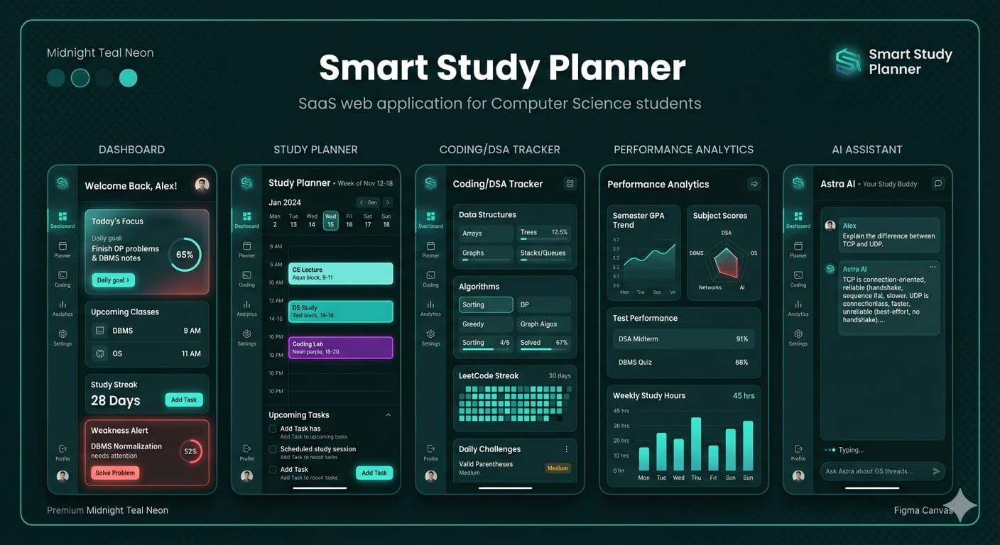
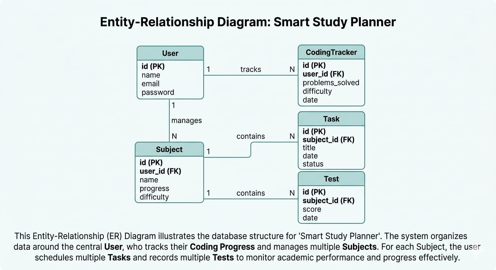

# 📘 Smart Study Planner

## 📌 Introduction

In today’s fast-paced academic environment, Computer Science students often struggle to manage multiple subjects, coding practice, and revision effectively. Traditional study methods lack proper planning, consistency, and personalized guidance, which leads to poor time management and weak performance in key subjects.

The "Smart Study Planner" is an AI-powered web application designed to help students organize their studies efficiently. It provides an intelligent platform where users can plan their daily study schedule, track their progress, and focus on improving weak areas.

This system is specially tailored for Computer Science students and includes core subjects such as Data Structures & Algorithms (DSA), Programming, DBMS, Operating Systems, Computer Networks, Software Engineering, Web Development, and Aptitude.

The application uses smart algorithms and AI assistance (Astra AI) to analyze user performance, detect weak subjects, and automatically generate a balanced study plan. It also includes features like revision scheduling, test planning, coding practice tracking, and performance analytics.

The main goal of this project is to enhance productivity, maintain consistency, and provide a structured approach to studying, making learning more efficient and stress-free for students.

Overall, the Smart Study Planner aims to act as a personal study assistant that guides students towards better academic performance and skill development.

# 📌 Problem Statement

In the current academic environment, Computer Science students face significant challenges in managing their studies effectively. With multiple subjects such as Data Structures & Algorithms, Programming, DBMS, Operating Systems, and others, students often struggle to maintain a proper balance between theory, coding practice, and revision.

Most students rely on manual planning methods such as notebooks or basic to-do lists, which are not efficient in tracking progress or identifying weak areas. These traditional approaches lack personalization and do not provide intelligent suggestions based on the student's performance.

Another major issue is the absence of a structured revision system. Students tend to forget previously studied topics due to irregular revision, leading to poor retention and lower performance in exams.

Additionally, students do not have a proper system to track coding practice, especially for DSA and problem-solving, which are essential for placements and technical interviews.

There is also a lack of tools that can automatically schedule tests, analyze performance, and provide actionable insights to improve weak subjects.

Therefore, there is a need for an intelligent, automated, and user-friendly system that can:
- Help students plan their study schedule efficiently
- Detect weak subjects based on performance
- Provide structured revision planning
- Track coding and DSA practice
- Suggest personalized study improvements using AI

The Smart Study Planner aims to solve all these problems by providing a centralized, AI-powered platform that enhances productivity and learning efficiency.

# 🎯 Objectives

The main objectives of the Smart Study Planner project are:

- To develop an intelligent system that helps Computer Science students plan and organize their study schedule effectively.

- To provide a balanced study plan that includes theory subjects, coding practice, and Data Structures & Algorithms (DSA).

- To detect weak subjects based on user performance, test scores, and study consistency.

- To implement a structured revision system that improves long-term retention of topics.

- To create a platform for tracking coding practice, including problem-solving and difficulty levels.

- To automatically schedule tests and quizzes to evaluate student performance.

- To provide performance analytics through visual representations such as charts and progress bars.

- To integrate an AI-based assistant (Astra AI) that gives personalized study suggestions and guidance.

- To design a modern, user-friendly, and visually appealing interface that enhances user experience.

- To improve overall productivity, consistency, and academic performance of students.

# 🌍 Scope of the Project

The Smart Study Planner is designed primarily for Computer Science students who need an efficient way to manage their academic workload, coding practice, and revision.

This system can be used by:
- College students pursuing Computer Science or related fields
- Students preparing for technical interviews and placements
- Learners who want to improve consistency and productivity in their studies

The application provides a centralized platform where users can manage multiple subjects, track their performance, and receive personalized study plans. It helps students balance theory subjects and practical coding skills, which is essential for academic success and career growth.

The scope of this project can be extended in the future by:
- Developing a mobile application version (Android/iOS)
- Integrating with online coding platforms like LeetCode or HackerRank
- Adding real-time notifications and reminders
- Implementing advanced AI features for deeper performance analysis
- Supporting multiple user roles such as teachers or mentors

However, the current system is limited to:
- Individual student usage
- Basic AI-based suggestions
- Web-based platform only

Overall, the Smart Study Planner has a wide scope in the education and productivity domain and can be further enhanced into a complete learning management system.

# ⚙️ Features of Smart Study Planner

The Smart Study Planner offers a wide range of intelligent and user-friendly features designed specifically for Computer Science students.

## 📚 1. Subject Management
- Add and manage multiple subjects such as DSA, Programming, DBMS, OS, CN, SE, Web Development, and Aptitude
- Track subject-wise progress
- Organize topics under each subject

## 🧠 2. Weak Subject Detection
- Automatically identify weak subjects based on:
  - Test scores
  - Skipped tasks
  - Low study time
- Highlight weak subjects with visual indicators

## 📅 3. Smart Study Scheduler
- Generate daily and weekly study plans automatically
- Balance between:
  - Theory subjects
  - Coding practice
  - DSA problem solving
- Prevent overloading by distributing tasks evenly

## 🔁 4. Revision Planner
- Automatically schedule revision sessions after:
  - 1 day
  - 3 days
  - 7 days
- Improve long-term memory retention
- Show reminders and revision streaks

## 📝 5. Test & Quiz Scheduler
- Schedule tests after topic completion
- Weekly mock tests
- Evaluate performance based on scores
- Provide subject-wise analysis

## 💻 6. Coding & DSA Tracker
- Track number of problems solved
- Categorize by difficulty (Easy / Medium / Hard)
- Maintain coding streaks
- Monitor improvement over time

## 📊 7. Performance Analytics
- Visual charts for:
  - Study hours
  - Subject progress
  - Test performance
- Identify strengths and weaknesses

## 🤖 8. AI Assistant (Astra AI)
- Suggest what to study next
- Recommend weak topics to focus on
- Provide smart study tips
- Guide users like a personal mentor

## 🔔 9. Reminders & Notifications
- Notify users about:
  - Pending tasks
  - Revision schedules
  - Upcoming tests

## 🎨 10. Modern UI/UX
- Clean and responsive design
- Midnight Teal theme with neon effects
- Smooth animations and transitions
- User-friendly navigation

## ⚡ 11. Productivity Features
- Daily study streak tracking
- Goal setting
- Focus mode for distraction-free study

Overall, these features work together to create an intelligent, efficient, and motivating study environment for students.

# 🏗️ System Architecture

The Smart Study Planner follows a three-tier architecture, which separates the application into three main layers:

## 🔹 1. Presentation Layer (Frontend)

This is the user interface of the application where users interact with the system.

- Built using HTML, Tailwind CSS, and JavaScript
- Provides pages such as Dashboard, Study Planner, Coding Tracker, and Analytics
- Displays data in the form of cards, charts, and schedules
- Handles user inputs and sends requests to the backend

## 🔹 2. Application Layer (Backend)

This layer handles the core logic and processing of the application.

- Built using Java and Spring Boot
- Processes user requests received from the frontend
- Implements features like:
  - Smart scheduling
  - Weak subject detection
  - Test evaluation
  - AI integration (Astra AI)
- Communicates with the database to store and retrieve data

## 🔹 3. Data Layer (Database)

This layer is responsible for storing and managing all application data.

- Uses MySQL database
- Stores information such as:
  - User details
  - Subjects
  - Tasks and schedules
  - Test results
- Ensures data consistency and retrieval efficiency

## 🔄 System Workflow

1. The user interacts with the frontend (UI)
2. The frontend sends a request to the backend via APIs
3. The backend processes the request and applies business logic
4. The backend interacts with the database to fetch/store data
5. The response is sent back to the frontend
6. The frontend updates the UI accordingly

## 🤖 AI Integration (Astra AI)

- The frontend sends user queries to the backend AI module
- The backend connects with an AI API (like OpenAI or Gemini)
- The AI processes the input and generates suggestions
- The response is displayed to the user in a chat interface

This layered architecture ensures scalability, maintainability, and efficient performance of the system.

## 📊 System Architecture Diagram

# 🛠️ Technology Stack

The Smart Study Planner is developed using modern web technologies to ensure efficiency, scalability, and a user-friendly experience.

## 🎨 1. Frontend Technologies

### HTML
- Used to structure the web pages
- Defines the layout of components like forms, buttons, and sections

### Tailwind CSS
- Used for designing a modern and responsive user interface
- Helps in creating a clean, visually appealing design with minimal custom CSS
- Supports fast UI development

### JavaScript
- Adds interactivity and dynamic behavior to the application
- Handles user actions like form submissions, task updates, and API calls

---

## ⚙️ 2. Backend Technologies

### Java
- A powerful, object-oriented programming language
- Ensures secure and scalable application development

### Spring Boot
- Used to build RESTful APIs
- Simplifies backend development with built-in features
- Handles business logic like scheduling, analytics, and AI integration

---

## 🗄️ 3. Database

### MySQL
- Used to store and manage application data
- Ensures efficient data retrieval and storage
- Handles data like users, subjects, tasks, and test results

---

## 🤖 4. AI Integration

### Astra AI (Custom AI Assistant)
- Provides personalized study suggestions
- Detects weak areas and recommends improvements

### AI APIs (OpenAI / Gemini)
- Used to generate intelligent responses
- Helps in analyzing user input and providing guidance

---

## 🧰 5. Development Tools

### Visual Studio Code
- Code editor used for frontend and documentation

### IntelliJ IDEA
- Used for backend (Spring Boot) development

### Git & GitHub
- Version control and project management

---

## 🌐 6. Other Technologies

### REST APIs
- Used for communication between frontend and backend

### JSON
- Used for data exchange between client and server

---

## 🎯 Conclusion

This technology stack is chosen to ensure:
- Fast and responsive UI
- Scalable backend architecture
- Efficient data management
- Intelligent AI-powered features

It provides a strong foundation for building a modern, reliable, and user-friendly web application.

# 🎨 UI/UX Design

The Smart Study Planner is designed with a modern, clean, and user-friendly interface to provide a smooth and engaging user experience.

## 🎯 Design Goals
- Simple and easy-to-use interface
- Visually appealing design
- Distraction-free study environment
- Fast and responsive performance

---

## 🌈 Color Theme (Midnight Teal Neon)

The application uses a unique and premium "Midnight Teal" color palette to create a calm and focused environment.

- Primary Color: #0D4F4F (Midnight Teal)
- Background: #0A2F2F (Dark teal black)
- Card Background: #123F3F (Glass effect)
- Accent Color: #2EC4B6 (Neon aqua glow)
- Secondary Accent: #5ED3CF
- Text Primary: #EAF7F7
- Text Secondary: #B0CFCF
- Weak Indicator: #FF6B6B
- Success Indicator: #80ED99

This color combination enhances readability and reduces eye strain during long study sessions.

---

## ✨ UI Design Features

- Glassmorphism effect with blurred backgrounds
- Soft shadows and clean card-based layout
- Sidebar navigation for easy access to features
- Responsive design for different screen sizes
- Clear typography using modern fonts like Poppins or Inter

---

## ⚡ Animations & Effects

To make the interface interactive and engaging, the following animations are used:

- Neon glow effects on buttons and active elements
- Hover animations with smooth transitions
- Animated "X" icon with neon pulse effect
- Weak subject cards with shake and red glow animation
- Progress bars with moving gradient effect
- Drag and drop animations in study planner
- AI assistant typing animation (Astra AI)

These animations improve user engagement and provide visual feedback.

---

## 🧠 User Experience (UX)

The application focuses on improving user productivity by:

- Providing easy navigation through sidebar and dashboard
- Highlighting important tasks and weak areas
- Reducing complexity with clean layouts
- Offering AI-based suggestions for better decision-making
- Ensuring fast and smooth interaction

---

## 📱 Responsiveness

The UI is fully responsive and adapts to:
- Desktop screens
- Tablets
- Mobile devices

---

## 🎯 Conclusion

The UI/UX design of Smart Study Planner ensures a balance between aesthetics and functionality. It provides a modern, intuitive, and motivating environment that helps students stay focused and productive.

# Figure : UI Design of Smart Study Planner

# 🗄️ Database Design

The Smart Study Planner uses a structured relational database (MySQL) to store and manage all application data efficiently.

## 📊 Main Tables

### 👤 1. User Table
Stores user information.

| Field Name | Data Type | Description |
|-----------|----------|-------------|
| id | INT (PK) | Unique user ID |
| name | VARCHAR | User name |
| email | VARCHAR | User email |
| password | VARCHAR | User password |

---

### 📚 2. Subject Table
Stores subjects added by the user.

| Field Name | Data Type | Description |
|-----------|----------|-------------|
| id | INT (PK) | Subject ID |
| name | VARCHAR | Subject name (DSA, DBMS, etc.) |
| progress | INT | Completion percentage |
| difficulty | VARCHAR | Easy / Medium / Hard |

---

### 📅 3. Task Table
Stores study tasks and schedules.

| Field Name | Data Type | Description |
|-----------|----------|-------------|
| id | INT (PK) | Task ID |
| subject_id | INT (FK) | Linked subject |
| title | VARCHAR | Task title |
| date | DATE | Scheduled date |
| status | VARCHAR | Pending / Completed |

---

### 📝 4. Test Table
Stores test and quiz data.

| Field Name | Data Type | Description |
|-----------|----------|-------------|
| id | INT (PK) | Test ID |
| subject_id | INT (FK) | Linked subject |
| score | INT | Marks obtained |
| date | DATE | Test date |

---

### 💻 5. Coding Tracker Table

| Field Name | Data Type | Description |
|-----------|----------|-------------|
| id | INT (PK) | Entry ID |
| user_id | INT (FK) | Linked user |
| problems_solved | INT | Number of problems |
| difficulty | VARCHAR | Easy / Medium / Hard |
| date | DATE | Practice date |

---

## 🔗 Relationships

- One user can have multiple subjects
- One subject can have multiple tasks
- One subject can have multiple tests
- One user can have multiple coding records

---

## 🧠 Database Design Concept

- Primary Key (PK): Uniquely identifies each record
- Foreign Key (FK): Connects related tables
- Ensures data consistency and integrity

---

## 🎯 Conclusion

The database is designed to efficiently manage user data, study schedules, performance records, and coding progress. It supports scalability and ensures smooth data handling for the application.

# ER Diagram

# 🚀 Future Enhancements

The Smart Study Planner has great potential for further development and improvement. Some possible future enhancements are:

## 📱 1. Mobile Application
- Develop an Android and iOS version of the application
- Provide better accessibility and real-time usage

## 🔔 2. Real-Time Notifications
- Add push notifications for:
  - Study reminders
  - Revision schedules
  - Upcoming tests

## 🌐 3. Integration with Coding Platforms
- Connect with platforms like LeetCode, HackerRank, or Codeforces
- Automatically track coding progress

## 🤖 4. Advanced AI Features
- Improve Astra AI with more intelligent recommendations
- Provide personalized learning paths
- Analyze user behavior for better suggestions

## 👨‍🏫 5. Multi-User System
- Add roles for teachers and mentors
- Allow mentors to assign tasks and monitor student performance

## 📊 6. Advanced Analytics
- Add detailed reports and insights
- Predict performance trends using AI

## 🗂️ 7. Cloud Storage Integration
- Store user data securely on cloud platforms
- Enable access from multiple devices

## 🎯 8. Gamification
- Add rewards, badges, and achievements
- Increase user motivation and engagement

## 🌍 9. Multi-Language Support
- Support multiple languages for wider accessibility

## 🔒 10. Security Enhancements
- Implement advanced authentication methods
- Ensure data privacy and security

---

## 🎯 Conclusion

These enhancements can transform the Smart Study Planner into a complete and intelligent learning management system, making it more powerful, scalable, and user-friendly.